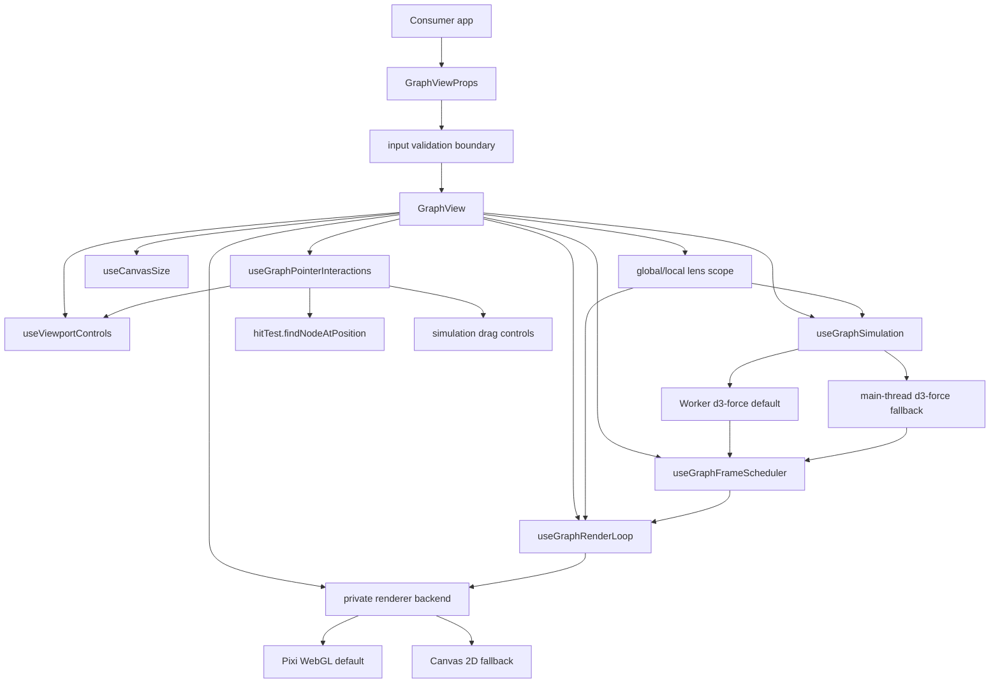

# Architecture

Ograph is split into a production graph package and a local Vite debug app.

## Package Boundary

Production consumers import only from:

```ts
src/components/graph/index.ts
```

The exported API contains:

- `GraphView`
- `GraphViewRef`
- graph data and configuration types from `types.ts`, including metadata-preserving `GraphViewProps<NodeMetadata, LinkMetadata>`
- `defaultGraphPreset`
- `defaultGraphTheme`

The library build prepends `"use client"` to `dist/index.js` so React server-component frameworks can detect the package entry as a client boundary after bundling.

The following files are local development surfaces and are not part of the production package contract:

- `src/App.tsx`
- `src/main.tsx`
- `src/components/graph/debug/*`

## Runtime Flow



`GraphView` composes focused hooks for canvas sizing, viewport control, pointer interaction, frame scheduling, render-loop animation, and simulation. Those hooks keep hot-path state in refs so high-frequency pointer and animation paths do not force React renders on every frame.

The render loop and simulation are connected through private backend/activity
interfaces. Package-facing `GraphView` selects Pixi WebGL plus Worker simulation
internally. WebGL initialization failure replaces that canvas once with the
Canvas 2D backend, and Worker construction, protocol, or runtime failure falls
back to the main-thread simulation. The debug harness can still inject any of
the four lanes through `DebugGraphView`, which is deliberately absent from
`index.ts`. Renderer and simulation choices therefore remain outside
`GraphViewProps`, `GraphViewRef`, and the published runtime/type entry points.

## Core Files

| File | Responsibility |
| --- | --- |
| `types.ts` | Public graph data, theme, preset, viewport, and prop contracts. |
| `GraphView.tsx` | React component composition, public ref methods, package-facing props, and tooltip rendering. |
| `inputValidation.ts` | Pure public-boundary sanitizers for nodes, links, and local depth before graph hooks run. |
| `GraphErrorBoundary.tsx` | Internal React error boundary that keeps graph render failures from unmounting a consumer app. |
| `useCanvasSize.ts` | Container measurement, DPR-aware canvas backing-store sizing, and resize/DPR watchers. |
| `useViewportControls.ts` | Viewport refs, fit-to-view, reset, immediate viewport updates, and animated viewport targets. |
| `useGraphFrameScheduler.ts` | Shared requestAnimationFrame scheduling and render request state. |
| `useGraphRenderLoop.ts` | Canvas draw-loop callback, focus and lens visibility animation, viewport easing, label animation, and spatial-index refresh. |
| `graphRenderer.ts` | Private renderer frame contract, Canvas 2D fallback adapter, and lazy Pixi loader. |
| `pixiGraphRenderer.ts` | Imperative Pixi WebGL backend with retained geometry, culling, and bounded text objects. |
| `pixiGraphPlanning.ts` | Pure viewport-priority and label-budget planning helpers used by the Pixi backend. |
| `graphRuntime.ts` | Internal production defaults, fallback resolution, lane names, Worker factory, and debug telemetry contract. |
| `useGraphRendererBackend.ts` | Renderer initialization, disposal, async error routing, and dirty-frame wake-up. |
| `useGraphPointerInteractions.ts` | Pointer capture, pan, node drag, hover hit testing, click/double-click handling, wheel zoom, and touch pinch zoom. |
| `useGraphSimulation.ts` | Persistent d3-force setup, graph indexes, degree calculation, cached layout positions, scoped force refresh, drag physics, and simulation restart. |
| `graphSimulationProtocol.ts` | Versioned Worker messages plus transferable packed-position validation. |
| `graphSimulation.worker.ts` | Worker d3-force runtime, drag controls, 60 Hz position publication, and transfer-buffer recycling. |
| `workerGraphSimulationClient.ts` | Main-thread Worker lifecycle, graph revision checks, packed-position application, and command adapter. |
| `useGraphLensScope.ts` | Global/local lens scope derivation, render-only transition union, and hidden physics halo scope. |
| `graphIndexes.ts` | Shared node lookup, degree, and focused-neighbor index helpers over the common undirected adjacency helper. |
| `graphDiff.ts` | Pure internal graph patch helper for deterministic node and duplicate-link add/remove/update detection. |
| `canvasRenderer.ts` | Canvas drawing entrypoint plus culled and batched link, node, label, dimming, focus, and color resolution passes. |
| `localGraph.ts` | Link ID normalization, shared undirected adjacency construction, reusable breadth-first traversal indexes, lens scoping, and transition scope merging. |
| `spatialIndex.ts` | Uniform-grid node index, padded viewport bounds, invalid-bounds guards, and crossing-link visibility checks. |
| `hitTest.ts` | Spatially scoped pointer-to-node hit testing in world coordinates. |
| `graphMath.ts` | Screen-to-world coordinate transforms, node radius calculation, and label visibility target calculation. |
| `presets.ts` | Default theme and force/render preset values. |

## Input Validation Boundary

`GraphView` validates consumer data before it reaches lens scoping, indexing, d3-force setup, pointer interaction, or canvas rendering. The sanitizers are pure functions in `inputValidation.ts`, so malformed import/restore/user-input cases can be tested without a browser or React render.

The boundary guarantees:

- nodes have non-empty string IDs,
- duplicate node IDs keep the first record and warn only in development,
- non-string labels are coerced to the node ID,
- links must connect existing node IDs,
- self-links where `source === target` are dropped,
- `localDepth` is a positive integer clamped from `1` through `10`.

The sanitizer does not normalize node positions, styling payloads, relationship metadata, selection IDs, hover IDs, or root IDs. Those values remain consumer-owned inputs and continue through the existing downstream guards. This keeps the public boundary defensive without changing the established physics, rendering, and interaction paths for valid data.

## Rendering Model

Rendering is canvas-based and happens outside the React tree:

1. `ResizeObserver` measures the container when available; older or test-like
   environments without it fall back to `getBoundingClientRect` plus window
   resize events.
2. Required outer-container, canvas, touch-action, and tooltip styles are applied inline so package consumers do not need Tailwind CSS or a package stylesheet for core graph behavior.
3. The canvas backing store is sized in physical pixels using a sanitized `devicePixelRatio`; invalid DPR falls back to `1`, and invalid CSS dimensions are clamped before writing canvas sizes.
4. The visible canvas size remains in CSS pixels.
5. A draw frame passes a renderer-neutral frame snapshot to the selected private backend. Pixi retains GPU-backed node/link batches and screen-space labels; the Canvas fallback clears the canvas, scales by DPR, and passes CSS-pixel dimensions into `drawGraph`.
6. The draw loop refreshes the uniform-grid spatial index only when simulation ticks can move nodes, render-node arrays change, or a render is explicitly requested after graph data changes.
7. Both backends use the same padded viewport, graph spatial index, viewport transform, focus/lens state, and label eligibility inputs.
8. Pixi updates retained batches in place; Canvas groups visible links and nodes into paths. Labels draw last in both lanes.

Spatial index queries return an empty result for non-finite, inverted, or otherwise invalid world bounds. Invalid cell sizes fall back to the default spatial cell size, and nodes with non-finite coordinates are skipped so malformed viewport or data inputs cannot create unbounded culling loops. Link culling also rejects invalid endpoint coordinates and applies a segment bounding-box check before the more expensive viewport-edge intersection checks.

The draw loop schedules frames when:

- props or config require a render,
- viewport changes,
- pointer state changes,
- canvas size or DPR changes,
- the d3 simulation is not paused and is still above `alphaMin`.

When the simulation cools and no explicit render is requested, frame scheduling stops.

### Worker simulation and main-thread fallback

The package starts a module Worker without changing the package API. The main
thread builds the same graph indexes and render-node objects, while the Worker
owns d3-force node velocity, force state, and timer work. Position frames are
packed as `x,y` pairs in a transferable
`Float32Array`; after applying them to the retained node objects, the client
transfers the buffer back for reuse. Every message carries a graph revision so
late frames from a disposed topology are ignored.

Pause, restart, drag pin/move/release, local drag heat, and connected-neighbor
wake are represented in the Worker protocol. Cleanup sends `dispose` and then
terminates the Worker, including React StrictMode remounts and runtime-lane
switches. Pause updates the existing Worker instead of recreating it, prevents
drag/restart messages from waking force timers while paused, and retains the
last alpha so resuming an already settled graph remains idle.

The library imports the simulation through Vite's Worker-constructor module.
Vite emits the module Worker under `dist/workers/` and generates one
package-relative `import.meta.url` asset reference in the library entry. Keeping
that reference single-layered lets downstream bundlers such as Vite and
Next.js/Turbopack rebase the Worker to the consumer's HTTP origin instead of
resolving an outer URL against the package file. The package allowlist publishes
the Worker asset with the lazy client chunk. Worker construction, protocol, or
asynchronous runtime failure is recovered once by selecting the existing
main-thread simulation. A recovered environment limitation does not call the
consumer's `onError`; an unrecovered graph failure still does.

### Pixi WebGL renderer and Canvas fallback

The Pixi lane initializes an `Application` asynchronously against the same
HTML canvas element that `GraphView` already owns. Renderer preference is the
single-item `['webgl']` list, so the experiment cannot silently turn into a
Canvas or WebGPU comparison. Pixi's ticker is stopped (`autoStart: false`), and
Ograph's dirty-frame scheduler calls `app.render()` only for simulation output,
input, easing, visual transitions, or pending materialization work. Resize and
DPR changes go through `renderer.resize`; disposal preserves the React-owned
canvas while releasing the WebGL context and retained children.
The lazy renderer wrapper exposes the concrete Pixi backend to the draw loop
only after `Application.init()` resolves. Render requests that arrive while
WebGL is being created return without delegating, and the renderer hook requests
a fresh frame after initialization completes. This prevents lane switches from
observing an `Application` before Pixi has installed its renderer. The lazy
chunk loads Pixi's CSP compatibility module before creating the application and
keeps that subpath external beside `pixi.js`, so both imports share one Pixi
extension registry in consumer bundles. Production consumers therefore do not
need to add `unsafe-eval` to `script-src`. If initialization fails, cleanup is
best-effort and the original initialization error remains authoritative even
when a partially initialized Pixi application also throws during disposal.
Changing graph fixtures or switching Main/Worker simulation keeps the renderer
and its WebGL context alive; only switching between Canvas 2D and Pixi replaces
the HTML canvas, because a canvas cannot change context type after acquisition.
This avoids a blank-frame/context-init penalty during the common retained
topology and simulation comparisons.

Geometry is retained across frames:

- node fills and borders are separate `ParticleContainer` batches that share
  high-resolution white circle/ring textures generated once during Pixi
  initialization;
- links are `Texture.WHITE` particles stretched and rotated between endpoints
  in one retained batch;
- node/link transforms, tint, alpha, and visibility update in place;
- viewport-prioritized nodes and endpoint-ready links materialize under
  per-frame budgets;
- structurally equivalent graph objects reuse retained particles, labels, and
  unfinished materialization queues when the Worker replaces input objects
  with simulation-backed objects;
- a cheap Pixi-only finite-coordinate scan proves when the padded viewport
  contains every topology node, allowing that frame to reuse the topology node
  array and skip a redundant grid query, visible-ID set, and per-link bounds
  test; partially containing viewports retain the existing padded culling path;
- padded viewport culling zeroes offscreen particle alpha and skips offscreen
  labels before their draw updates;
- screen-space text is created lazily, capped at 800 retained objects, and
  limited to 600 visible labels while idle or 280 during focus/interaction;
- pointer hit testing remains on Ograph's existing main-thread spatial index,
  with Pixi event traversal disabled.

When simulation, focus/lens/label easing, viewport animation, and incremental
materialization are all idle, the dirty-frame scheduler stops completely. The
debug telemetry exposes the active frame reasons so an apparently settled graph
cannot silently keep calling either Canvas draw or `app.render()`.

`pixi.js` and its CSP compatibility subpath remain external to Ograph's own
library chunks so consumer bundlers can deduplicate one exact runtime
dependency. The package entry loads the backend lazily, publishes package-owned
chunks under `dist/chunks/`, and
keeps cold initialization visually background-only without adding a spinner or
public loading state. If WebGL creation or renderer initialization fails,
`GraphView` remounts exactly one replacement canvas with the Canvas 2D backend.
The debug harness disables this automatic recovery so a selected experiment
cannot silently turn into another lane.

Graph-owned errors report through `onError` in three places: the React error
boundary, the requestAnimationFrame draw loop, and simulation setup/tick
scheduling. A renderer or simulation environment failure first gets one
internal fallback opportunity; only an unrecovered error reaches `onError`.
Draw-loop and simulation errors stop the failed graph lane before fallback or
reporting. Consumer callback errors remain consumer-owned and are not converted
into graph `onError` events.

## Simulation Model

`useGraphSimulation` maps incoming `GraphNode[]` and `GraphLink[]` into d3-force compatible structures. The physics refresh is keyed by a topology signature rather than by array references, so consumers can pass fresh node and link arrays on each render without reheating the simulation when the graph structure has not changed.

The topology signature is the sorted node ID multiset plus the sorted valid undirected link multiset. Link endpoints are normalized with `getLinkId`, source/target order is ignored, duplicate links are preserved, and dangling links are excluded by the same existing-node rule used by `buildGraphIndexes`. Node and link payload fields such as labels, types, metadata, weights, and strengths are not topology inputs because the current force model does not use per-link force parameters.

For each topology refresh it:

1. Caches current node coordinates and velocities by node ID.
2. Builds adjacency and degree maps from valid links through `buildGraphIndexes`, which reuses the same endpoint validation and undirected adjacency helper as local lens traversal.
3. Recreates active simulation node objects using cached coordinates when possible.
4. Normalizes valid link endpoints with `getLinkId`.
5. Updates the persistent d3-force simulation through `simulation.nodes(...)` and the link force through `links(...)`.
6. Resynchronizes render refs against the newly active node objects so transition ghosts stay aligned during lens changes.
7. Calls `onTick` so the component can schedule canvas redraws.

Between topology refreshes, payload-only updates are applied in place to the active node objects. This keeps labels, node type, group, sanitized size, and metadata current while preserving d3-owned layout state (`x`, `y`, `vx`, `vy`, `fx`, `fy`). Size changes refresh the collide force's cached radii and give cooled simulations a minimal alpha kick so collision spacing can settle without a full graph rebuild. The hook keeps the latest graph inputs in refs so topology effects do not read stale arrays after raw graph references are removed from the dependency list.

`growthAnimation` runs before local-lens scoping. The growth hook sorts nodes by
a consumer timestamp, defaults to `metadata.createdAt`, and exposes only the
currently revealed node/link subset to the existing lens and simulation
pipeline. A link is included only when both endpoint nodes have already been
revealed. This keeps chronological replay app-agnostic: metadata decides reveal
order, while d3-force still owns the physical attachment and settling behavior.
Missing or invalid timestamps fall back to input order after timestamped nodes.

When `growthAnimation` is disabled, the hook returns the complete graph without
extracting timestamps, sorting a sequence, or constructing the sequence
signature. The complete frame's `revealedNodeIds` set is reused as the render
loop's source-node set. Enabled animation still follows the same sequence,
timing, revealed-count synchronization, and link eligibility rules.

Node-focus camera requests run after lens scoping and simulation refs are
available. They only target IDs in the current visible scope, so hidden local
halo nodes and unrevealed growth-animation nodes are treated as unavailable
rather than errors. The request computes a viewport from the node's current
world coordinate and the existing target camera scale unless a scale option is
provided.

Signature calculation sorts node IDs and normalized links, making it `O(n log n + m log m)` for each new input array pair. That cost is intentionally paid inside `ograph` to avoid more expensive d3-force reconstruction for reference-unstable consumers; if very large graphs make signature calculation the bottleneck, the signature helper is the boundary for a future incremental hash.

`paused` stops the d3-force timer without unmounting the canvas or discarding cached coordinates. Graph refreshes while paused still update refs, forces, and render data, but they do not restart the timer until `paused` returns to `false`. The render loop also treats a paused simulation as inactive, even if its alpha remains above `alphaMin`, so a frozen layout cannot keep requestAnimationFrame alive by itself.

Cooling is mode-based, not node-count based. Global mode keeps d3-force's default alpha curve (`alphaMin = 0.001`, `alphaDecay ~= 0.0228`) so large graphs continue to settle conservatively. Local mode uses `alphaMin = 0.005` and default `alphaDecay = 0.08` to stop the short invisible tail that otherwise keeps small focus lenses ticking and redrawing after note changes. Consumers can override only `alphaDecay` through `GraphPreset`; `alphaMin` stays internal because it is a termination threshold rather than a design-facing physics control.

The simulation uses:

- `forceManyBody().strength(preset.chargeStrength)`
- `forceLink(...).distance(preset.linkDistance).strength(0.85)`
- `forceCollide(...).radius(physics node radius + preset.collisionRadius).strength(0.9)`. Physics node radius includes `nodeRadius`, sanitized node `size`, and `degree`, but ignores `nodeSizeScale` so visual size changes do not re-layout the graph.
- `forceX(0)` and `forceY(0)` scaled by `gravityStrength * 0.4`
- `velocityDecay(preset.velocityDecay ?? 0.4)` for stable layout settling. Values are clamped to d3-force's `0` through `1` range; lower values preserve velocity longer for a floatier feel, while higher values damp motion faster for a heavier feel.
- `alphaDecay(preset.alphaDecay ?? modeDefault)` for cooling speed. Values are clamped to `(0, 1]`; invalid or non-positive values fall back to the mode default.
- `alphaMin(modeDefault)` as the internal cooling stop threshold.

## Drag Physics

Global-mode node dragging:

1. Reheats the simulation with `alphaTarget(0.78)`.
2. Pins the dragged node through `fx` and `fy`.
3. Updates the node position in world coordinates.
4. Applies a bounded wake to first- and second-degree neighbors.
5. Releases `fx` and `fy` on drag end and lets the simulation cool.

Neighbor wake is intentionally bounded so high-degree nodes do not pull the entire graph too aggressively. Direct neighbors receive stronger position and velocity influence than second-degree neighbors.

Local-lens node dragging uses the same pin/update/release path, but applies the local lens drag policy instead of the global one:

- drag start reheats at `alphaTarget(0.08)`,
- drag movement keeps the simulation active at `alphaTarget(0.05)`,
- connected-neighbor wake is disabled,
- drag end still clears `fx`/`fy` and returns `alphaTarget` to `0` so the lens cools normally.

This keeps local lens physics alive during drag without letting a single local interaction re-run the full global-style neighbor wake inside the scoped halo. The debug harness displays the current drag phase, dragged node ID, drag event count, active alpha targets, and connected-wake policy so local/global drag behavior is observable while tuning.

When `paused` is true, dragging can still update the dragged node's fixed coordinates through the normal pointer path, but drag start and movement do not reheat or restart d3-force. Releasing the drag still clears `fx` and `fy`.

Pointer capture loss is not treated as drag end. Some embedded browser shells
can emit `lostpointercapture` while pointer movement continues, so drag cleanup
belongs to `pointerup`, `pointercancel`, or component unmount. A release-only
window fallback also listens for `pointerup`, `pointercancel`, and `mouseup` so
the graph can clear `fx`/`fy` and return `alphaTarget` to `0` if the canvas
misses the terminal event after capture changes. It does not own pointer
movement or alter drag force values.

## Local Focus Lens

Local mode uses `buildLocalGraphScope(nodes, links, rootNodeId, depth)`. It is a focus lens over the global layout rather than a separate layout.

The lens:

- treats links as undirected,
- uses every valid provided link for traversal without interpreting `link.type`,
- builds one traversal index per scope calculation and reuses it for visible nodes plus the hidden physics halo,
- starts from `rootNodeId`,
- shows nodes visited up to `localDepth`,
- retains one additional hidden BFS ring in the force simulation,
- fades lens-external nodes and links during a 360ms transition,
- starts the next visible scope plus hidden halo simulation as soon as the lens changes,
- keeps the union of the previous and next render scopes during the transition,
- draws lens-external nodes as frozen ghosts while they fade,
- reheats local scope refreshes at a lower alpha so cached global positions stay recognizable,
- applies faster local cooling defaults so the lens stops ticking shortly after it becomes visually stable,
- uses low-heat local drag reheating so dragged local nodes remain in the live simulation without collapsing the lens around the dragged node,
- preserves the local scope centroid as the gravity center so isolated or one-neighbor roots do not drift toward global origin while the viewport zooms,
- fits the lens viewport once from cached global coordinates when the visible scope changes,
- restores the captured global viewport when returning to global mode.

If `rootNodeId` is missing, local mode behaves like global mode. If the root ID does not exist, the lens is empty and the camera does not move. Reduced-motion users receive immediate visibility, viewport, and force-scope changes.

Adjacency is Set-based, so duplicate links do not duplicate local traversal or focus-neighbor membership. Degree calculation still counts link records so visual importance and force metadata preserve the input edge count.

Links with endpoints missing from the provided node list are dropped before local traversal, graph indexes, and d3-force link setup. This keeps malformed imported data from creating hidden traversal IDs or simulation-only failures.

Relationship semantics stay outside the package boundary. If a consumer wants local mode to expand through only some relationship types, it should pass a filtered `links` array for local mode and the full link set for global mode.

`rootNodeId` and `selectedNodeId` remain separate state channels. The production component renders whichever controlled values the consumer passes; the debug harness clears its diagnostic selection when a node becomes the local root or when the mode returns to global so a root-focus action does not leave stale selection dimming behind.

## Hit Testing

`findNodeAtPosition` converts pointer coordinates from screen space to graph world space, queries nearby uniform-grid cells, then checks candidate nodes using squared distance. Hidden and halo-only nodes are excluded from hit testing.

Hit testing returns no match for non-finite pointer coordinates, invalid viewport values, zero or negative viewport scale, or nodes with non-finite coordinates. This keeps malformed restored viewport state from creating infinite world hit radii or false-positive pointer hits.

The hit radius is the larger of:

- the rendered node radius,
- a minimum 10 CSS-pixel screen target converted into world units.

This keeps small or zoomed-out nodes clickable without making the rendered node visually larger.

## Viewport Coordinates

The viewport shape is:

```ts
interface GraphViewport {
  x: number;
  y: number;
  scale: number;
}
```

World-to-screen conversion:

```ts
screenX = worldX * scale + x;
screenY = worldY * scale + y;
```

Screen-to-world conversion:

```ts
worldX = (screenX - x) / scale;
worldY = (screenY - y) / scale;
```

Wheel and pinch zoom share one anchored-zoom helper that preserves the world coordinate under the pointer or pinch center, clamps the next scale, then updates a target viewport. Invalid pointer or viewport inputs return no update instead of creating a non-finite target viewport. The render loop eases the displayed viewport toward that target so repeated wheel and pinch input feels anchored without snapping.

Fit-to-view ignores nodes with explicit non-finite coordinates and treats absent `x`/`y` values as the existing origin fallback. Empty graphs, all-invalid coordinate sets, and non-positive or non-finite container dimensions do not produce a viewport update.

## Label Culling

Labels always render for:

- hovered node,
- selected node,
- root node,
- active neighbors during hover or selection focus.

Other labels use a density heuristic:

```ts
densityThreshold = (1.0 - labelDensity) * 12.0;
nodeImportance = degree * viewport.scale * 2.2;
revealWidth = Math.max(1.2, densityThreshold * 0.35);
visibility = smoothstep(
  Math.max(0, densityThreshold - revealWidth * 0.5),
  densityThreshold + revealWidth * 0.5,
  nodeImportance
);
```

Higher `labelDensity`, higher zoom, and higher degree all make labels appear earlier. The density threshold is the center of a soft reveal band rather than a hard boolean cutoff, so ordinary labels resolve to a target opacity between `0` and `1`.

The computed opacity is treated as the target visibility value, not an immediate draw/remove switch. `GraphView` keeps per-node label visibility in a ref and eases it each animation frame, so labels fade in and out as zoom, density, degree, or focus changes move them through the reveal band.

Consumers can optionally cap label paint work through
`GraphPreset.labelRenderBudget`. The settled cap applies to ordinary draw
requests. The interaction cap applies while pointer input, viewport easing,
simulation, or focus/lens/label transitions are active and falls back to the
settled cap when omitted. Budgeted frames select labels before either
`strokeText` or `fillText` runs. Hovered, selected, and root labels are always
retained; focused neighbors then rank ahead of ordinary labels, followed by
visibility, degree, and original node order. The default preset leaves both
caps unset, preserving the existing unbounded label pass.

## Dimming

Hover and selection focus dim unrelated nodes, links, and labels using the preset's `hoverDimming` or `selectionDimming` multiplier. The active dim amount is eased in the render loop, so entering and leaving focus fades between full opacity and the configured dimmed opacity.

Semantic hover clears as soon as hit testing returns no node or the pointer leaves the canvas. During the fade-out, `GraphView` keeps the previous focus ID only for rendering transition overlays. `canvasRenderer` draws the normal link/node first, then draws the hover/selection/neighborhood color as a progress-scaled overlay. That makes connected line highlights start fading immediately instead of remaining at full hover strength until dimming finishes.

## Build Outputs

`npm run build` runs:

1. `npm run build:demo`
2. `npm run build:lib`

The demo build goes to `dist/demo`. The package build emits:

- `dist/index.js`
- `dist/index.d.ts`
- `dist/chunks/*.js` for package-owned lazy graph modules
- `dist/workers/*.js` for the module simulation Worker

`vite.lib.config.ts` uses package-relative asset URLs and marks `d3-force`,
`pixi.js`, `react`, `react/jsx-runtime`, and `react-dom` as external. The build
cleanup removes only the previous library entry/chunk/Worker outputs, preserving
the independently generated demo and declarations. Package budgets track the
synchronous entry, aggregate lazy chunks, and Worker asset separately.
